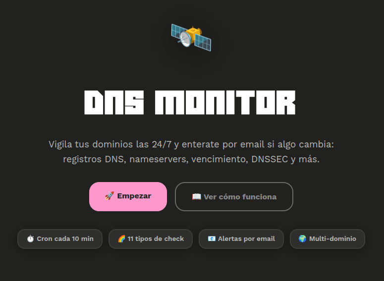
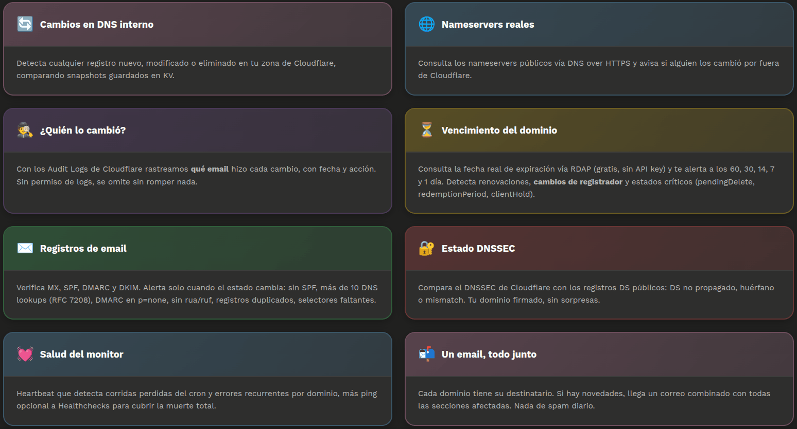
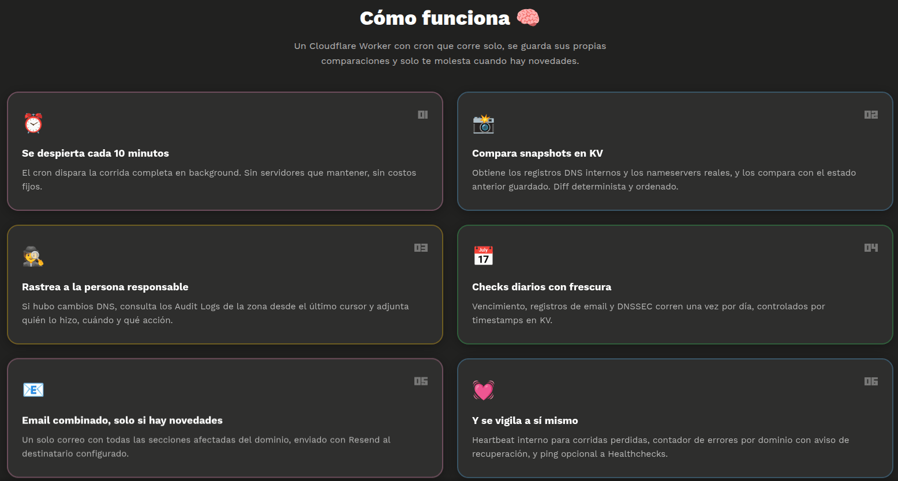
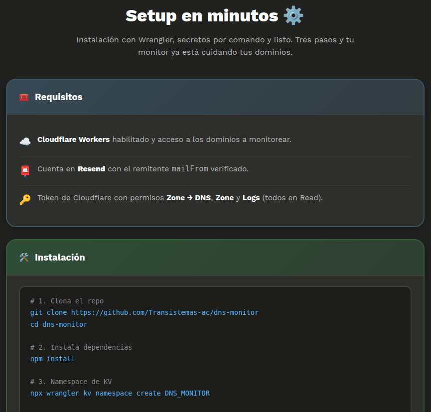
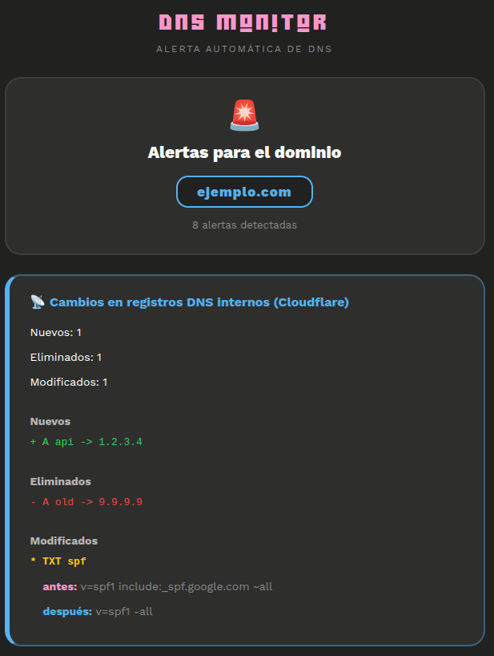
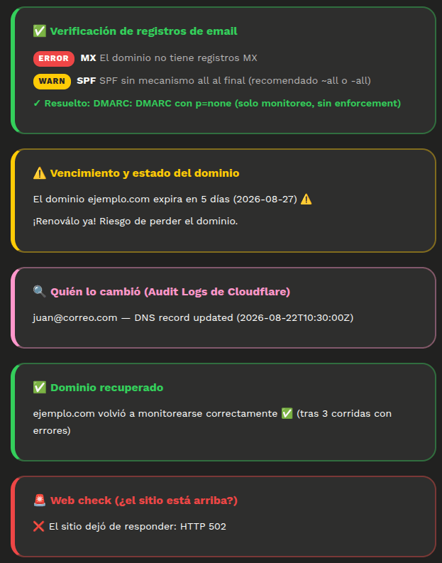

<h1 align="center">🛰️ DNS Monitor</h1>

<p align="center">
  <a href="README.md">🇪🇸 Español</a> - 🇬🇧 English
</p>

<p align="center">
  Domain and infrastructure monitoring with real-time alerts: detects changes to DNS, nameservers, registrar, DNSSEC, email configuration, website availability, and monitor health.
</p>
<p align="center">
  Multi-tenant SaaS on Cloudflare Workers: sign up, connect your accounts, and watch your domains from a dashboard — no installation required.
</p>

<br>

## 📸 Screenshots

<table>
  <tr>
    <td align="center"></td>
  </tr>
  <tr>
    <td align="center"></td>
  </tr>
  <tr>
    <td align="center"></td>
  </tr>
  <tr>
    <td align="center"></td>
  </tr>
  <tr>
    <td align="center"></td>
  </tr>
  <tr>
    <td align="center"></td>
  </tr>
</table>

<br>

## ⚙️ Features

**Multi-tenant SaaS** (default mode):

- 🧑‍💻 **Registration and login** with email verification (welcome email + confirmation link), password recovery, and password change from the dashboard
- 🌍 **Per-user dashboard**: domains with live status (last run, errors), add/edit/delete with real token validation against the Cloudflare API, and a customizable emoji per domain (optimistic picker, no refresh)
- 📊 **Alert history** per domain with pagination
- 🔔 **Global alert channels**: email (configurable destination), **Telegram** (bot + chat id), **Discord** (webhook), and **generic Webhook** (JSON POST + optional HMAC signature) — all with a "Test" button
- 🔐 Each user's tokens are encrypted with **AES-256-GCM** (operator `MASTER_KEY`) and are never shown again

**Monitoring engine** (a Cloudflare Worker with a `*/10 * * * *` cron):

- changes in the internal DNS records (Cloudflare)
- changes in the real domain nameservers (DNS over HTTPS)
- **who** made each DNS change (Cloudflare Audit Logs)
- domain expiration (RDAP, free, no API key), including **registrar changes** and **critical statuses** (`pendingDelete`, `redemptionPeriod`, `clientHold`)
- email records: **MX, SPF, DMARC, DKIM** (DoH), plus the **SPF DNS lookup limit** (RFC 7208) and **DMARC rua/ruf** report addresses
- **DNSSEC** status (Cloudflare + public DS records)
- **CAA** records (optional) and **HTTPS (SVCB)** in the apex
- **nameserver consistency** between 1.1.1.1 and 8.8.8.8 (possible DNS hijacking/fragmentation)
- **web check** (optional): is the site actually responding over HTTPS?
- monitor health: missed runs and recurring errors (heartbeat)

Every alert is delivered to your configured channels (email + Telegram/Discord/webhook) and stored in the history.

<br>

## 🚀 How it works

1. **You sign up** — email + password, then confirm your email.
2. **You connect your accounts** — paste your Cloudflare token (read-only) and Resend API key; they are encrypted and validated instantly.
3. **You add your domains** — zone ID, domain, and recipient; 3 free domains per account.
4. **You configure your channels** — email, Telegram, Discord, or webhook, with a "Test" button.
5. The cron runs **every 10 minutes**: it compares snapshots in KV, runs the daily checks (expiry, email, DNSSEC) and, if there's anything new, dispatches it to your channels and stores it in the history.

<br>

## 🏗️ Architecture

```
                    ┌─────────┐
                    │  Cron   │
                    └────┬────┘
                         ▼
┌──────────────┐   ┌──────────────┐      ┌──────────────┐
│ Cloudflare   │──►│ Check Engine │ ───► │ Snapshot KV  │
│ DNS / Audit  │   └──────┬───────┘      └──────────────┘
└──────────────┘          │                    │
                          │              ┌─────┴──────┐
               ┌──────────┼───────────┐  │   D1       │
               ▼          ▼           ▼  │ users /    │
             DNS       RDAP/DoH    HTTPS │ domains /  │
               │          │           │  │ alerts /   │
               └──────────┼───────────┘  │ channels   │
                          ▼              └────────────┘
                   ┌────────────┐              │
                   │ Alert      │◄─────────────┘
                   │ Engine     │
                   └─────┬──────┘
                         ▼
              Email · Telegram · Discord · Webhook
```

**Components**:

| Piece | Role |
| ----- | ---- |
| `D1` | Users, sessions, domains (with encrypted secrets), alert history, and channels |
| `KV` | DNS/NS snapshots, freshness timestamps, audit cursors, heartbeats |
| `crypto` | PBKDF2 for passwords and AES-256-GCM for each user's tokens |
| `assets` | Landing page and design system (`public/`) |

<br>

## 🚀 For users

1. Go to **Create free account** → confirm your email.
2. In the dashboard: **Add domain** with:
   - Your **Zone ID** from Cloudflare (Overview → API section) — validated against the API instantly
   - Your **Cloudflare token** with `Zone → DNS → Read` (optional: `Zone → Zone → Read`, `Zone → Logs → Read`)
   - Your **Resend API key** and a verified sender (e.g. `dns@yourdomain.com`)
3. In **Alerts** (navbar): configure the destination email, **Telegram** (create a bot with @BotFather), **Discord** (channel webhook), or your own **Webhook**. Use "Test" to validate each one.
4. Each domain's emoji can be changed from its card (emoji picker, saved instantly).

> System emails (welcome, confirmation, recovery) are sent by the instance using the operator's `RESEND_API_KEY`.

<br>

## 🔧 For operators (deploy)

Requirements: `npm install`, a Cloudflare account with Workers + D1.

```bash
# 1. Database
npx wrangler d1 create dns-monitor          # copy the id into wrangler.toml
npx wrangler d1 migrations apply dns-monitor --remote

# 2. KV namespace
npx wrangler kv namespace create DNS_MONITOR   # copy the id into wrangler.toml

# 3. Secrets
npx wrangler secret put MASTER_KEY          # base64 of 32 bytes: openssl rand -base64 32
npx wrangler secret put RESEND_API_KEY      # system emails (welcome, verify, reset)

# 4. Variables (wrangler.toml)
#    SYSTEM_MAIL_FROM = "DNS Monitor <no-reply@yourdomain.com>"  # sender verified in Resend

# 5. Deploy
npx wrangler deploy
```

- `MASTER_KEY` encrypts every user's tokens: **do not lose it** (it cannot be recovered).
- The operator's `RESEND_API_KEY` is only used for system emails; each user uses their own key for their alerts.
- Optional Healthchecks.io: `npx wrangler secret put HEALTHCHECKS_URL`.
- Migrations: `npx wrangler d1 migrations apply dns-monitor --remote` after each new `migrations/*.sql`.

<br>

## 🧪 Quick test

Create a test DNS record in any monitored domain:

- Type: `TXT`
- Name: `dns-test`
- Content: `test`

You should receive the alert on your channels (email/Telegram/Discord/webhook) within 10 minutes, including the "Who changed it" section (if the token has `Zone → Logs → Read`).

To trigger the cron manually in development:

    npx wrangler dev --test-scheduled
    curl "http://localhost:8787/__scheduled?cron=*/10+*+*+*+*"

> The daily checks (expiry, email, DNSSEC) run once every 24 h. To force them, delete the `last_*_ts_<zoneId>` keys from KV.

<br>

## 🔍 Logs

    npx wrangler tail

<br>

## ⚡ Functions

**HTTP / SaaS** (`fetch`):

- `handleFetch(request, env)`: Router — pages (`/register`, `/login`, `/logout`, `/verify`, `/resend`, `/forgot`, `/reset`, `/change-password`, `/app`, `/app/alertas`) and JSON APIs (`/api/domains`, `/api/channels`, `/api/settings`). Origin check (CSRF) and login rate-limiting via KV.
- `sendVerificationEmail` / `sendWelcomeEmail` / `sendResetEmail`: System emails with one-time tokens (24 h / 1 h) through the operator's Resend.
- `handleApiDomains`: Domain CRUD with token validation against the Cloudflare API (`GET /zones/{id}` with a `dns_records` fallback for DNS-only tokens) and Resend key validation; 3-domain quota; secret rotation.
- `handleApiChannels`: Create/test/delete channels with per-type validation (Telegram `getMe`, Discord webhook, HTTPS webhook) and encrypted configs.
- `handleApiSettings`: Account-wide alert email.
- `sendToChannels(env, channel, data)`: Alert dispatcher — Telegram (`sendMessage`, 4096 split), Discord (`content`, 2000), and Webhook (JSON POST + HMAC-SHA256 in `X-DNS-Monitor-Signature`).

**Engine** (`scheduled`):

- `scheduled(event, env, ctx)`: Cron entry point; triggers `runCheck` in the background.
- `runCheck(env)`: Orchestrates the run: heartbeat, per-domain check, error recovery, Healthchecks ping, email/channel dispatch, history logging, and per-domain status (`last_check_ts` / `last_error`).
- `getDomains(env)`: Reads domains from **D1** (SaaS mode, decrypting secrets per row) or from the `DOMAINS` variable (legacy self-host mode).
- `checkDomain(env, domain)`: Internal DNS + nameservers + audit logs + daily checks with KV freshness control.
- `checkMissedRuns` / `pingHealthchecks` / `recordDomainError` / `clearDomainError`: Internal heartbeat, external watchdog, and per-domain error counter.
- `checkDomainExpiry` (RDAP), `checkEmailRecords` (MX/SPF/DMARC/DKIM), `checkDnssec` (CF + public DS), `checkCaa`, `checkWeb`, `checkNsConsistency` (1.1.1.1 vs 8.8.8.8), `checkHttpsRecord` (SVCB).
- `dohQuery(name, type)`: DNS-over-HTTPS helper.
- `fetchAllDnsRecords(zoneId, apiToken)`: Paginates the zone's DNS records.
- `normalizeRecords` / `diffRecords`: Deterministic snapshots and record diffs.
- `buildEmailBody` / `buildEmailText` / `sendEmail`: Combined per-domain email.

<br>

## 🛡️ Security

- The repo **contains no secrets**. Everything is managed with `npx wrangler secret put ...` and `.dev.vars` (gitignored) for development.
- Each user's tokens are encrypted with **AES-256-GCM** using `MASTER_KEY`; channel configs too.
- Passwords use **PBKDF2-SHA256** (100k iterations), sessions use httpOnly cookies + SameSite=Lax + Origin check.
- User isolation is guaranteed by Cloudflare itself: each token can only read its owner's zones.
- The Workers runtime blocks connections to private IPs (mitigates SSRF on the generic webhook).

<br>

## 📝 License

MIT.
You can use this monitor to watch any domain: DNS changes, nameservers, expiry, email records, DNSSEC, and monitor health.

<br>

---

_🌈 Created with pride by the Transistemas Development Team ❤_